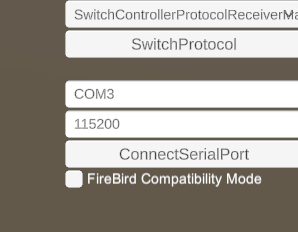

# VisualSpyViewer

通常のビューアーでは表現できないジャイロの情報や、その他様々な便利な情報を表示できるビューアーです。
現在はβリリースで、Switchプロコンのみの対応です。

## 使い方
[Releases](https://github.com/ATForefront/VisualSpyViewer/releases) ページよりWindows版zipファイルがダウンロードできます。
お好みの場所に解凍し、フォルダ内のVisualSpyViewer.exeを実行してください。

実行すると、画面右上に設定項目があります。
以下の設定以外は現状弄らなくてOKです。

### COMポート指定
VisualSpyが認識されているシリアルポートを入力します。

### FireBird Compatibility Mode
ぼんじりさん作のプロコン型基板、[FireBird](https://bzl.booth.pm/items/4934916)で使用する際にチェックボックスを有効化してください。

上記の設定を行った後、ConnectSerialPortボタンを押すと
ボタンなどの押下表示やジャイロのプレビューを使用できます。

## ライセンス
MITライセンスで公開しています。
このプロジェクトの改善協力は大歓迎です！
